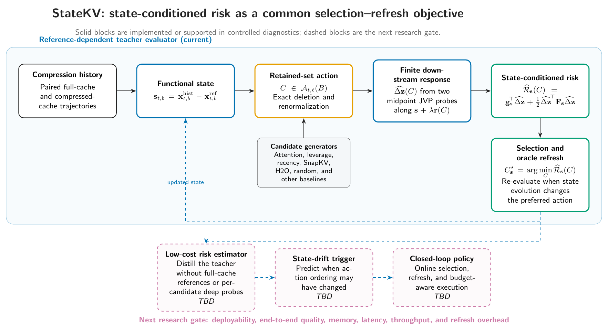

# StateKV

**State-conditioned physical risk for KV-cache selection and refresh.**

StateKV is a research prototype for reasoning about repeated KV-cache
compression as a sequential intervention. The current repository validates a
reference-dependent teacher evaluator in controlled diagnostics; it does not
yet contain a deployable online selection-and-refresh policy.

The method evaluates retained-set actions under the functional state created by
earlier cache decisions. L1/L2 leverage, attention, recency, value norm,
SnapKV, H2O, Fisher geometry, and related scores remain baselines, candidate
generators, or diagnostics—not as StateKV itself.



The editable [TikZ source](assets/statekv-architecture.tex) and vector
[PDF](assets/statekv-architecture.pdf) are versioned with the repository.

## Research question

Static token scores assume that a candidate has the same consequence whenever
it is evaluated. Repeated compression breaks that assumption: earlier evictions
change later queries, attention, residual streams, and KV contents. StateKV asks
a more specific question:

> Given the compressed trajectory observed now, which retained set produces the
> smallest increase in output risk, and when does state evolution invalidate
> that choice?

This separates three roles that are easy to conflate:

1. **Candidate generation** proposes legal retained sets at a fixed budget.
2. **State-conditioned evaluation** estimates the finite downstream effect and
   its incremental output risk under the current trajectory.
3. **Selection and refresh** choose the lowest-risk candidate and re-evaluate
   when the preferred action may have changed.

## Minimal formulation

Compression history is represented at boundary $b$ by a functional
displacement from a paired full-cache reference:

$$
\mathbf{s}_{t,b}
=
\mathbf{x}^{\mathrm{hist}}_{t,b}
-
\mathbf{x}^{\mathrm{ref}}_{t,b}.
$$

For a retained set $C$, the teacher computes the exact local
deletion-and-renormalization response, transports that finite action through the
downstream network, and evaluates the second-order increment in reference KL at
the current state:

$$
\widehat{\mathcal R}_{\mathbf s}(C)
=
\mathbf g_{\mathbf s}^{\top}\widehat{\Delta\mathbf z}(C)
+
\frac{1}{2}
\widehat{\Delta\mathbf z}(C)^{\top}
\mathbf F_{\mathbf s}
\widehat{\Delta\mathbf z}(C).
$$

Selection and refresh share this risk object:

$$
C^{\star}_{\mathbf s}=\arg\min_{C\in\mathcal A_{t,\ell}(B)}
\widehat{\mathcal R}_{\mathbf s}(C),
\qquad
\text{oracle refresh if }
C^{\star}_{\mathbf s_t}\ne C^{\star}_{\mathbf s_{t-1}}.
$$

The refresh rule above is an **oracle diagnostic**. A low-cost state-drift
detector that works without the full-cache reference is a next-stage component,
not a current result.

## What has been established

The manuscript draft and frozen artifacts support the following bounded
findings. Values below are reported from the stored structured results; they are
not newly generated claims.

| Finding | Stored evidence | Scope |
|---|---|---|
| Exact set-level deletion identity reaches a maximum FP64 L2 error of $2.26\times10^{-11}$. | [P0 identity rows](experiments/p0_v2_fixed_boundary/results/identity_rows.parquet) | Fixed operating point and stored candidate protocol. |
| Physical boundary replay reaches sequence-first cosine $\approx 1$ and relative L2 $8.09\times10^{-7}$. | [P0 summary](experiments/p0_v2_fixed_boundary/results/p0_v2_summary.json) | Controlled fixed-boundary replay. |
| Evaluating at the observed state improves the P1 diagnostic to cosine $0.99974$ and relative L2 $0.02255$. | [P1 operating-point summary](experiments/p1_state_conditioned/results/state_operating_point_summary.json) | Four stored sequences on the frozen Qwen protocol. |
| The finite-action approximation has a visible trust region: cosine falls from $0.99986$ at amplitude $1/16$ to $0.95463$ at amplitude $1$; the median residual slope is $1.983$. | [R1 summary](experiments/p2_recovery/r1_amplitude_trust_region/results/r1_summary.json) | Retrospective amplitude study. |
| The two-midpoint state-local scalar-risk evaluator obtains Spearman $1.0$ and top-1 gain $1.0$ in both evaluation and replication splits, outperforming the stored action-only ranking. | [Evaluation](experiments/p2_recovery/r4_scalar_decision_risk/results/evaluation/analysis_summary.json), [replication](experiments/p2_recovery/r4_scalar_decision_risk/results/replication/analysis_summary.json) | Frozen candidate pools; scalar ranking only, not full-vector closure. |
| Dense all-layer mechanistic risk transfers across the limited P3PR model/task study (Spearman $1.0$ formal, $0.9940$ replication; top-1 $1.0$), while the relative single-boundary shortcut does not pass the same gate. | [P3PR summary](experiments/p3pr_generalization/results/analysis/analysis_summary.json) | Two model families, two task families, and the stored splits. |

The current distinction is important: a same-state physical evaluator and a
candidate-specific teacher are supported in the frozen protocols, while the
online policy remains future work.

These results support the mechanism and the teacher evaluator. They do **not**
yet establish:

- a low-cost risk estimator that removes full-cache references and deep
  per-candidate probes;
- a deployable refresh trigger;
- subset-level physical closure beyond the frozen action protocols;
- end-to-end free-generation quality preservation;
- latency, memory, throughput, and refresh-overhead gains at matched budgets;
- universal transfer of a single relative boundary across models and tasks.

Same-step KL is therefore an evaluator target, not a substitute for downstream
generation quality.

## Repository architecture

```text
statekv/
  core/                    stable paper-facing state, action, risk, decision API
  storage.py               atomic JSON, text, frame, gzip, and NPZ writes
  backend*.py              model/backend adapters
  selectors.py             candidate generators and baseline selectors
  functional_*.py          functional-state probes and features
  *risk*, *fisher*, ...    research instrumentation and analysis modules
configs/
  ccfa.yaml                project stage, claims, evidence, and next gates
  discovery/               active discovery and smoke configurations
  stages/                  active staged experiments
  frozen/                  immutable evaluation-time protocols
experiments/               frozen phase code, manifests, and structured results
benchmarks/
  mlx/                     Apple-Silicon execution and baselines
  torch/                   PyTorch/CUDA execution and baselines
analysis/                  derived tables and publication analysis
assets/                    architecture source and rendered deliverables
tests/
  core/                    tests for the stable StateKV contract
  golden/                  frozen parity and protocol tests
```

The dependency direction is deliberate:

```text
statekv.core  <-  research instrumentation  <-  experiment protocols
     ^                    ^                            ^
     |                    |                            |
 pure contracts     model-aware logic          frozen evidence runs
```

`statekv.core` must not import benchmark backends or experiment modules.
Backend-specific execution belongs under `benchmarks/<backend>/`; reusable
StateKV logic belongs under `statekv/`. The benchmark projects support the
research claim but do not define it.

## Paper-facing Python API

The stable core exposes the mathematical objects without importing a model
backend:

```python
from statekv import (
    functional_history_state,
    select_lowest_risk,
    set_level_attention_delta,
    state_conditioned_quadratic_risk,
)

state = functional_history_state(history_boundary, reference_boundary)
boundary_delta = set_level_attention_delta(attention, values, retained_positions)
risk = state_conditioned_quadratic_risk(
    reference_logits, state_logits, candidate_delta_logits
)
decision = select_lowest_risk({"candidate-a": float(risk_a), "candidate-b": float(risk_b)})
```

`set_level_attention_delta` implements the exact fixed-operating-point action.
Finite downstream transport remains model-aware and is available through
`statekv.core.midpoint_path_response`. `oracle_refresh_required` deliberately
states its diagnostic status in its API documentation.

## Installation

The project targets Python 3.9+ and separates the canonical package from the
two backend harnesses:

```bash
python3 -m venv .venv
.venv/bin/python -m pip install -U pip
.venv/bin/python -m pip install -e benchmarks/torch
.venv/bin/python -m pip install -e benchmarks/mlx
.venv/bin/python -m pip install -e .
```

Model-scale runs additionally require local model weights, dataset access, and
appropriate MPS or CUDA hardware. Unit tests do not validate a full model run.

## Verification

Run the dependency-light research-path check:

```bash
PYTHONPYCACHEPREFIX=/tmp/statekv-pycache \
  .venv/bin/python scripts/smoke_test.py
```

It covers configuration loading, cache budgeting, leverage-based candidate
generation, functional measurement, output-risk utilities, refresh scheduling,
the exact retained-set action, and the stable state/risk/decision API.

Run the repository suite with:

```bash
.venv/bin/python -m pytest
```

Run each backend suite from its own project root because the MLX fixtures use
backend-relative configuration paths:

```bash
(cd benchmarks/mlx && ../../.venv/bin/python -m pytest tests)
(cd benchmarks/torch && ../../.venv/bin/python -m pytest tests)
```

## Experiment and evidence map

The machine-readable inventory is
[`experiments/frozen_registry.yaml`](experiments/frozen_registry.yaml). Frozen
phases preserve positive, negative, recovery, and generalization evidence:

| Phase family | Scientific role |
|---|---|
| Predictive closure / local Jacobian | Records why static and overly local surrogates were insufficient. |
| P0-v2 | Validates the exact action identity, physical replay, and fixed-boundary response. |
| P1 / P2 | Tests state conditioning and records failed state-local shortcuts. |
| P2 recovery R1–R4 | Identifies the finite-action trust region and closes scalar decision risk. |
| P3 / P3 physical recovery | Tests decision validity under propagated histories and recovers a physical evaluator. |
| P3PR | Probes cross-model/task generalization and rejects the universal relative-boundary shortcut. |

Negative evidence is part of the result: a completed negative experiment must
not be relabeled as a failed run. Failed, interrupted, smoke, obsolete-protocol,
and in-progress outputs remain distinct statuses.

## Recommended next work

The shortest path from the current teacher evaluator to a publishable system is:

1. **Lock the teacher protocol.** Define one canonical retained-set action
   schema, candidate pool, budget policy, sequence split, and target metric.
   Rerun it into a new output directory and confirm that the stored conclusions
   survive the refactored API.
2. **Distill a low-cost risk estimator.** Use teacher risks as labels, split by
   sequence/task/model rather than candidate rows, and compare against
   action-only, attention, recency, leverage, SnapKV, and H2O baselines. Report
   Spearman, pairwise accuracy, top-1 accuracy, normalized regret, calibration,
   and estimator cost together.
3. **Learn or design a state-drift trigger.** Label an event when oracle
   re-evaluation changes the preferred candidate. Measure missed switches,
   precision/recall, refresh frequency, hysteresis, and probe overhead. The
   deployed trigger must not use the full-cache reference.
4. **Run closed-loop generation.** At matched cache budgets, compare quality,
   peak memory, prefill/decode latency, throughput, refresh count, and refresh
   overhead against strong static and refresh baselines. This is the gate that
   turns StateKV from an evaluator into a cache policy.
5. **Stress generalization.** Vary model family and scale, task family, context
   length, cache budget, candidate pool, and action size. Preserve the current
   distinction between dense-mechanism transfer and relative-boundary failure.

Do not optimize the manuscript around a deployment claim before steps 2–4 have
real results. The current paper story is strongest when it cleanly distinguishes
the validated teacher mechanism from the planned online estimator and policy.

## Reproducibility rules

For every new formal run:

1. start from a frozen configuration but assign a new experiment ID and output
   directory;
2. store the resolved semantic configuration, command, seed, model/tokenizer
   revision, dataset revision, and exact sample IDs;
3. write structured JSON, CSV, or Parquet results atomically;
4. separate calibration, evaluation, and replication splits;
5. classify the run status explicitly and never overwrite frozen evidence;
6. update `configs/ccfa.yaml` only after a gate changes.

Historical checksums may remain as evaluation-time metadata. New code should
prefer semantic configuration equality and immutable external revisions over
generic repository-wide checksum boilerplate.

This repository intentionally keeps one Markdown documentation entry point:
this README. Machine-readable state belongs in YAML/JSON/CSV/Parquet; figures
belong in `assets/` or `analysis/figures/`.

## Citation and license

The StateKV paper is in preparation and has no archival citation identifier.
Until one is published, cite the repository commit and the relevant frozen
experiment manifest. Do not cite the earlier L1/geometry project name as the
StateKV method.

See [LICENSE](LICENSE) for licensing terms.
