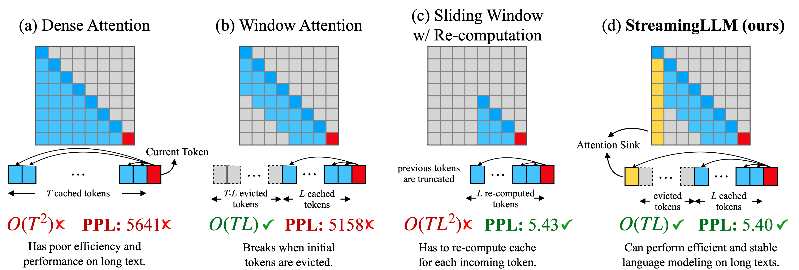

# 基于注意力汇聚的高效流式语言模型
[[论文](http://arxiv.org/abs/2309.17453)] [[幻灯片](assets/StreamingLLM.pdf)] [[视频](https://youtu.be/hvJsEzP34o8)]



https://github.com/mit-han-lab/streaming-llm/assets/40906949/2bd1cda4-a0bd-47d1-a023-fbf7779b8358

## 一句话概述
我们使大语言模型能够处理无限长度的输入，同时不牺牲效率和性能。

## 新闻动态

- [2024/02] StreamingLLM 被 [MIT News 作为焦点报道](https://news.mit.edu/2024/new-way-let-ai-chatbots-converse-all-day-without-crashing-0213)！
- [2024/01] StreamingLLM 被 HPC-AI Tech [SwiftInfer](https://github.com/hpcaitech/SwiftInfer) 集成，支持无限输入长度的 LLM 推理。
- [2024/01] StreamingLLM 被 NVIDIA [TensorRT-LLM](https://github.com/NVIDIA/TensorRT-LLM/tree/main/examples/llama#run-llama-with-streamingllm) 集成！
- [2023/12] StreamingLLM 被 CMU、UW 和 OctoAI 集成，在 [iPhone](https://x.com/davidpissarra/status/1735761373261427189?s=20) 上实现了无限且高效的 LLM 生成！
- [2023/12] StreamingLLM 被 HuggingFace Transformers [合入](https://github.com/huggingface/transformers/pull/26681)。
- [2023/10] StreamingLLM 被集成到 [Intel Extension for Transformers](https://github.com/intel/intel-extension-for-transformers) 中。
- [2023/10] [Attention Sinks](https://github.com/tomaarsen/attention_sinks)，一个第三方实现，使 StreamingLLM 支持更多 Huggingface 上的 LLM。

## 摘要
在多轮对话等流式应用中部署大语言模型（LLM）的需求十分迫切，但这面临两大挑战。首先，在解码阶段，缓存之前所有 token 的 Key 和 Value 状态（KV）会消耗大量显存。其次，主流 LLM 无法泛化到比训练序列更长的文本。窗口注意力（仅缓存最近的 KV）是一种自然的思路——但我们发现当文本长度超过缓存大小时，该方法便会失效。我们观察到一个有趣的现象，即**注意力汇聚（attention sink）**：保留初始 token 的 KV 可以在很大程度上恢复窗口注意力的性能。在本文中，我们首先证明了注意力汇聚现象的出现是由于模型对初始 token 赋予了极高的注意力分数，使其成为"汇聚点"，即使这些 token 在语义上并不重要。基于上述分析，我们提出了 StreamingLLM，这是一个高效的框架，使得使用有限长度注意力窗口训练的 LLM 无需任何微调即可泛化到无限序列长度。我们证明 StreamingLLM 可以使 Llama-2、MPT、Falcon 和 Pythia 在高达 400 万甚至更多 token 的情况下进行稳定高效的语言建模。此外，我们发现，在预训练阶段添加一个占位符 token 作为专用的注意力汇聚点，可以进一步提升流式部署的性能。在流式场景下，StreamingLLM 相比滑窗重计算基线方法可实现高达 22.2 倍的加速。

## 使用方法

### 环境配置

```bash
conda create -yn streaming python=3.8
conda activate streaming

pip install torch torchvision torchaudio
pip install transformers==4.33.0 accelerate datasets evaluate wandb scikit-learn scipy sentencepiece

python setup.py develop
```

### 运行流式 Llama 聊天机器人

```bash
CUDA_VISIBLE_DEVICES=0 python examples/run_streaming_llama.py  --enable_streaming
```

## 常见问题

1. **对 LLM 而言，"处理无限长度输入"意味着什么？**

   让 LLM 处理无限长度的文本面临诸多挑战。首先，存储所有历史的 Key 和 Value（KV）状态需要大量内存，其次模型可能难以生成超出其训练序列长度的文本。StreamingLLM 通过仅保留最近的 token 和注意力汇聚点（attention sinks），并丢弃中间 token 来解决这个问题。这使得模型可以在不重置缓存的情况下，基于最近的 token 生成连贯的文本——这是此前方法所不具备的能力。

2. **LLM 的上下文窗口是否被扩展了？**

   没有。上下文窗口大小保持不变。只有最近的 token 和注意力汇聚点被保留，中间的 token 被丢弃。这意味着模型只能处理最新的 token。上下文窗口仍然受限于其初始预训练设定。例如，如果 Llama-2 的预训练上下文窗口为 4096 个 token，那么 StreamingLLM 在 Llama-2 上的最大缓存大小仍然是 4096。

3. **我可以将整本书这样的长文本输入 StreamingLLM 进行摘要吗？**

   虽然你可以输入长文本，但模型只能识别最新的 token。因此，如果输入是一本书，StreamingLLM 可能只会总结结尾的段落，这或许意义不大。正如前面强调的，我们既没有扩展 LLM 的上下文窗口，也没有增强其长期记忆能力。StreamingLLM 的优势在于基于最近的 token 生成流畅的文本，而无需刷新缓存。

4. **StreamingLLM 的理想应用场景是什么？**

   StreamingLLM 专为流式应用而优化，例如多轮对话。它非常适合模型需要持续运行但不需要大量内存或依赖历史数据的场景。一个典型的例子是基于 LLM 的日常助手。StreamingLLM 可以让模型持续运行，基于最近的对话进行响应，而无需刷新缓存。此前的方法要么在对话长度超过训练长度时需要重置缓存（从而丢失最近的上下文），要么需要从最近的文本历史中重新计算 KV 状态，这非常耗时。

5. **StreamingLLM 与最近的上下文扩展研究有何关系？**

   StreamingLLM 与最近的上下文扩展方法是正交的，并且可以与之集成。在 StreamingLLM 的语境中，"上下文扩展"是指使用更大的缓存来存储更多的最近 token。具体演示请参阅我们论文中的 Figure 9，我们展示了 StreamingLLM 与 LongChat-7B-v1.5-32K 和 Llama-2-7B-32K-Instruct 等模型结合使用的效果。

## 待办事项
我们将按以下顺序发布代码和数据，敬请关注！

- [x] 发布 StreamingLLM 核心代码，包括 Llama-2、MPT、Falcon 和 Pythia。
- [x] 发布困惑度评估代码
- [x] 发布流式 Llama 聊天机器人演示。
- [ ] 发布 StreamEval 数据集和评估代码。

## 引用

如果您发现 StreamingLLM 对您的项目和研究有用或相关，请引用我们的论文：

```bibtex
@article{xiao2023streamingllm,
        title={Efficient Streaming Language Models with Attention Sinks},
        author={Xiao, Guangxuan and Tian, Yuandong and Chen, Beidi and Han, Song and Lewis, Mike},
        journal={arXiv},
        year={2023}
        }
```
